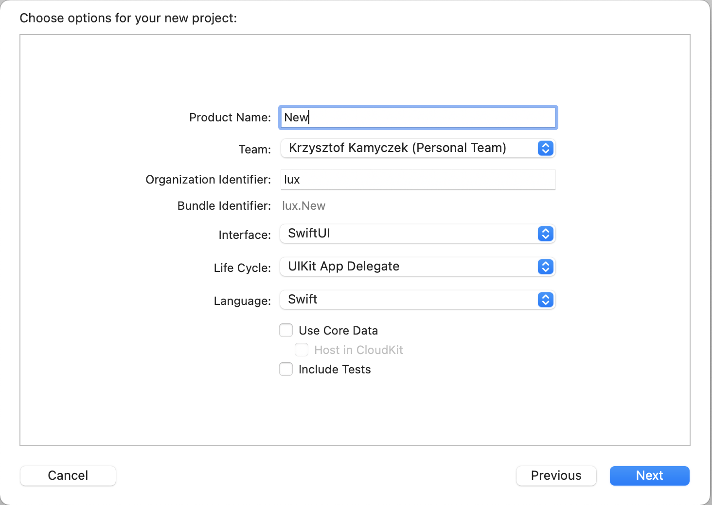
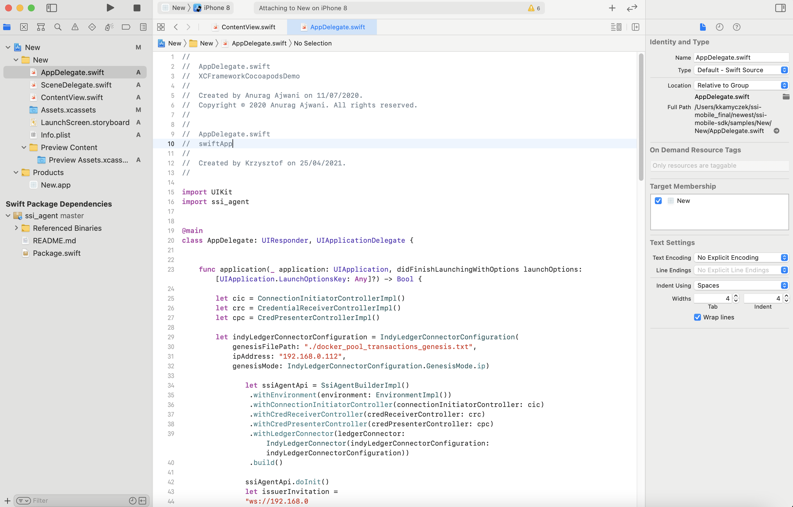
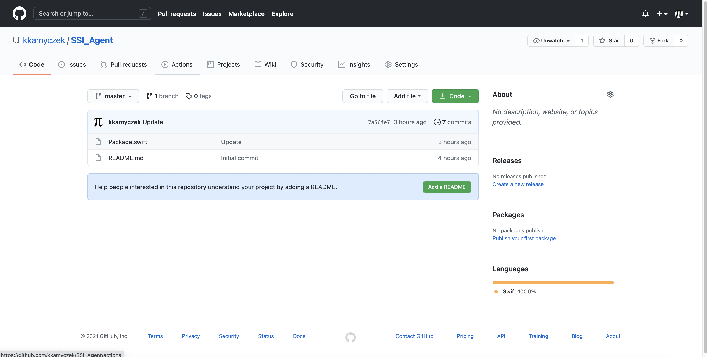
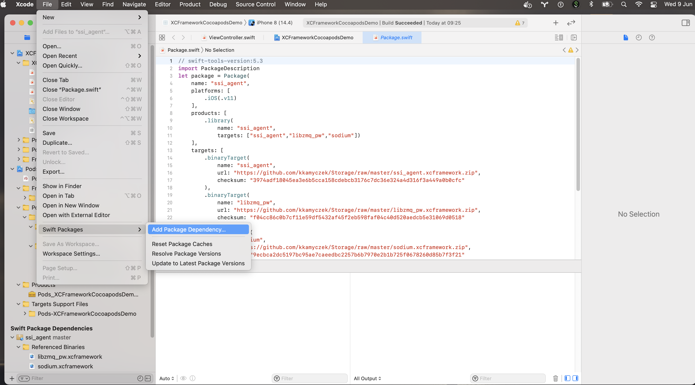
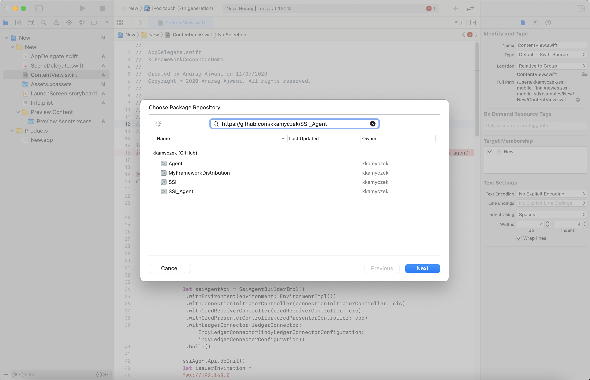
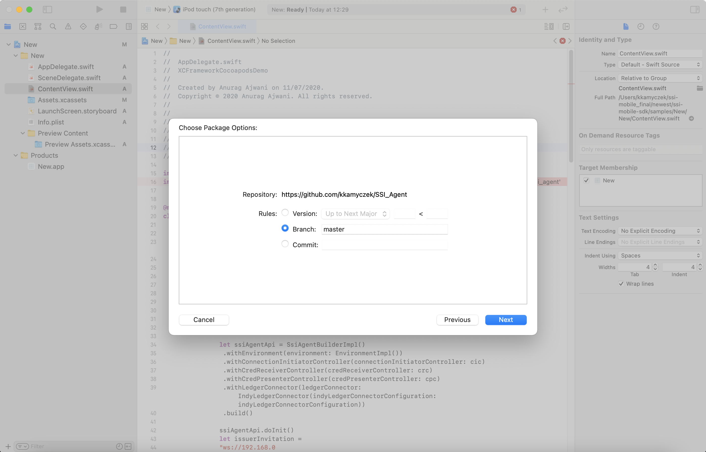
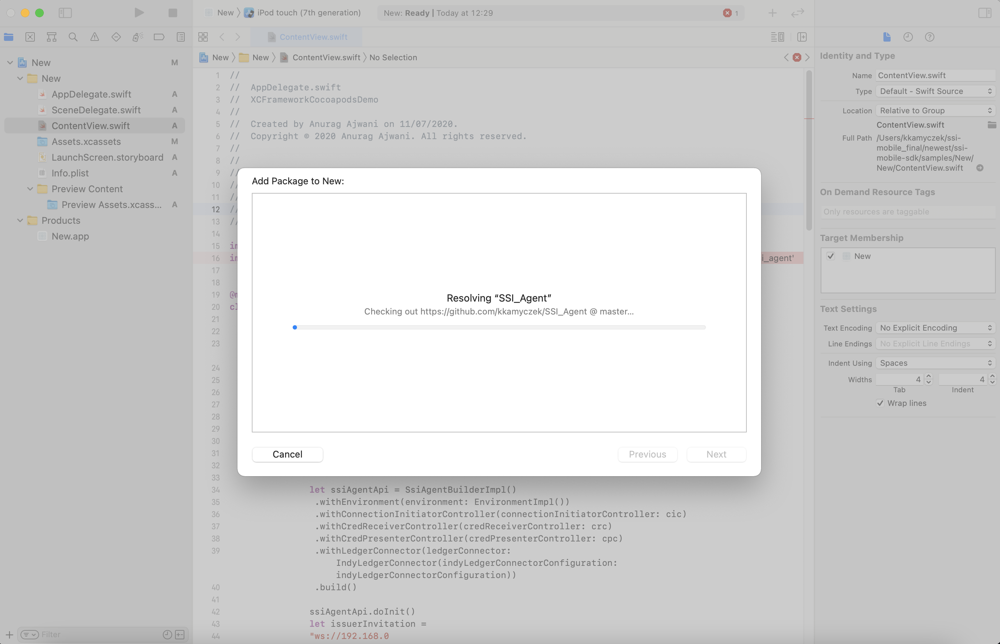
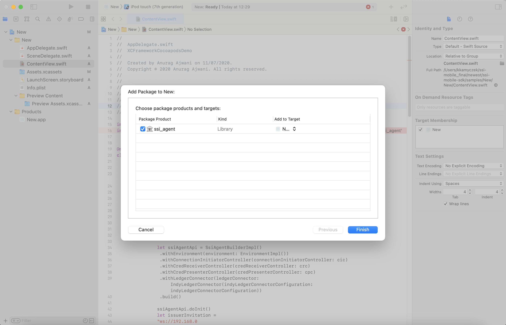
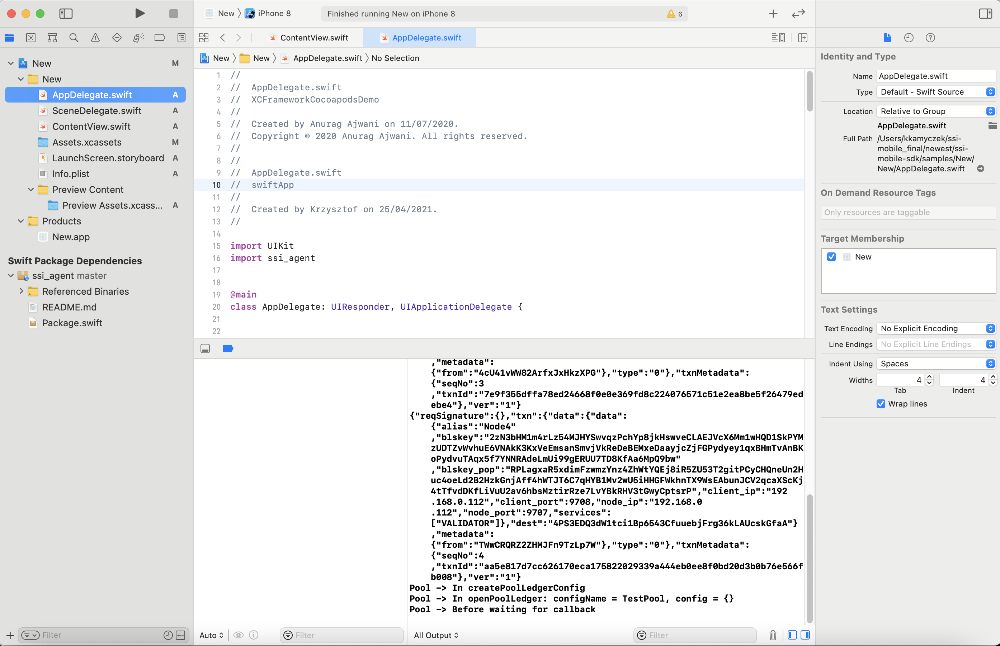

1. Create new Swift project 

2. Copy test scenario to AppDelegate.swift from SwiftIosApp (samples/swiftIosApp/swiftIosApp/AppDelegate.swift) - set proper IP Addresses - ledger and agents

3. Check access to open source repository where agent library is stored.

4. Add Swift package dependency:

5. Add access to repository - https://github.com/kkamyczek/SSI_Agent

6. Select **master** branch 

7. Wait

8. Click Finish

9. Remember to set rights IP addresses and click Build and Run.

